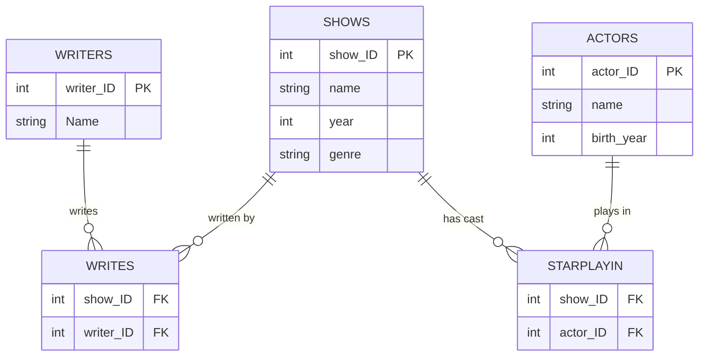

# Design Practice: ERD

> This is not the final solution or a well-designed ERD.

```mermaid
erDiagram
    WRITERS ||--o{ WRITES : writes
    SHOWS   ||--o{ WRITES : "written by"
    ACTORS  ||--o{ STARPLAYIN : "plays in"
    SHOWS   ||--o{ STARPLAYIN : "has cast"

    WRITERS {
        int writer_ID PK
        string Name
    }
    WRITES {
        int show_ID FK
        int writer_ID FK
    }
    SHOWS {
        int show_ID PK
        string name
        int year
        string genre
    }
    STARPLAYIN {
        int show_ID FK
        int actor_ID FK
    }
    ACTORS {
        int actor_ID PK
        string name
        int birth_year
    }
```
